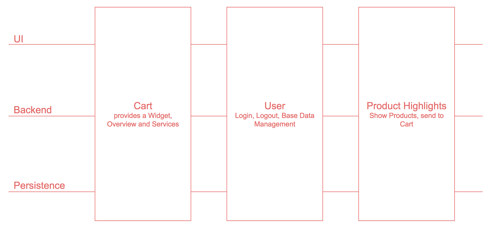
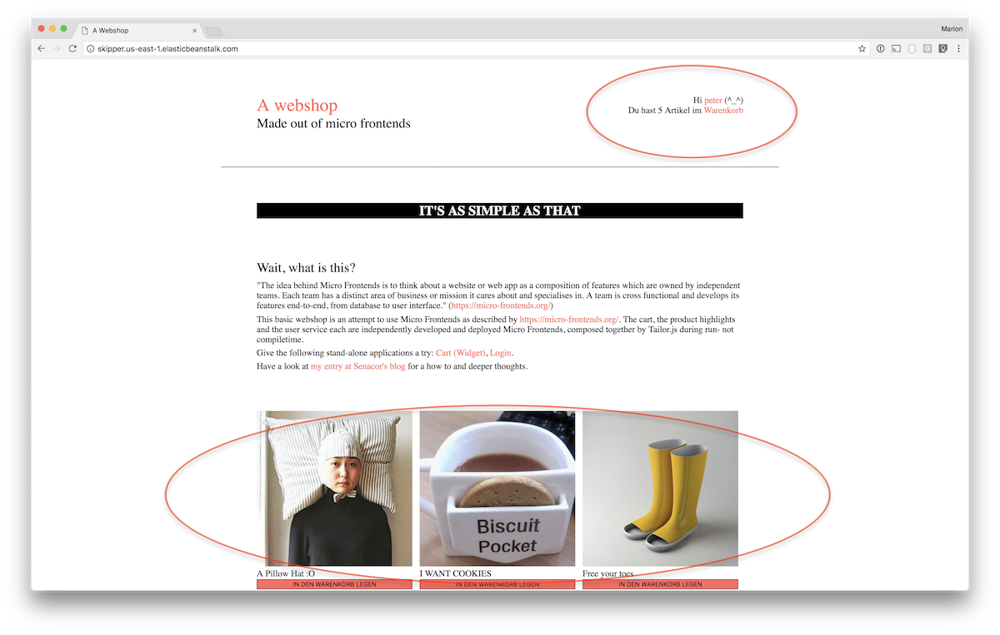

# Micro Frontends: Documentation

This repository describes various concepts which allow development and deployment of Micro Frontends.

I implemented a POC covering this topic, [jump to "Project Mosaic"](#project-mosaic) to have a look.

Also I'm looking for a couple of people and/or external input to answer questions covered at ["Future research"](#future-research)

## Contents

- [What are Micro Frontends](#what-are-micro-frontends)
- [Motivation](#motivation)
- [Various approaches to build Micro Frontends](#various-approaches-to-build-micro-frontends)
    - [Project Mosaic](#project-mosaic)
- [Future research](#future-research)

## What are Micro Frontends?

> The idea behind Micro Frontends is to think about a website or web app as a composition of features which are owned by independent teams. Each team has a distinct area of business or mission it cares about and specialises in. A team is cross functional and develops its features end-to-end, from database to user interface.

micro-frontends.org

## Motivation

In an ideal world a single team has a mission or business value to fulfill and has all tools to be capable to do so in its hand. With traditional web applications this is impossible to realize. No matter which technology you choose, in the end your React.js, Angular or Vue.js application gets compiled to a huge frontend monolith. However, similar to microservices in the backend you should enable your team to have their own release cycles, tools sets and deployment. If a team's mission is to build a webshop's cart application it should be able of fulfilling this task by developing everything from storage and logic to the UI and therefore be a real vertical team. To allow vertical teams in combination with web applications you need a UI composition strategy to sew everything together at one or the other point.

## Various approaches to build Micro Frontends

When I talk about Micro Frontends, I talk about web based GUIs which are composed at runtime. If multiple applications get sewed together at compile time, the Micro Frontend concept does not solve problems like independent release cycles and high exchangeability.
Furthermore Micro Frontends can be rendered at the server or client, both approaches are valid, can be mixed and might have their own dis- and advantages.

### Project Mosaic

... is a collection of tools, allowing server- and clientside rendering of Micro Frontends. The project contains tools like Tailor.js for UI composition, Skipper for HTTP routing and Tessellate for SSR. I implemented a POC using a couple of Project Mosaic's tools. The tools I didn't use, are largely un-documented or not open source.

#### POC I implemented using Project Mosaic

I implemented three natively server side rendered React.js applications, composed with Tailor.js and routed with Skipper: Cart, User and Product Highlight application

Have a look at the applications and service setups and their documentation to understand the details of this POC:

- [Cart application](https://github.com/vuza/micro-frontends-cart)
- [Product Highlight application](https://github.com/vuza/micro-frontends-highlights)
- [User application](https://github.com/vuza/micro-frontends-user)
- [Tailor.js setup](https://github.com/vuza/micro-frontends-tailor)
- [Skipper setup](https://github.com/vuza/micro-frontends-skipper)

## Future research

// TODO challenges: Communications, Authorization, ...
// TODO describe sprints